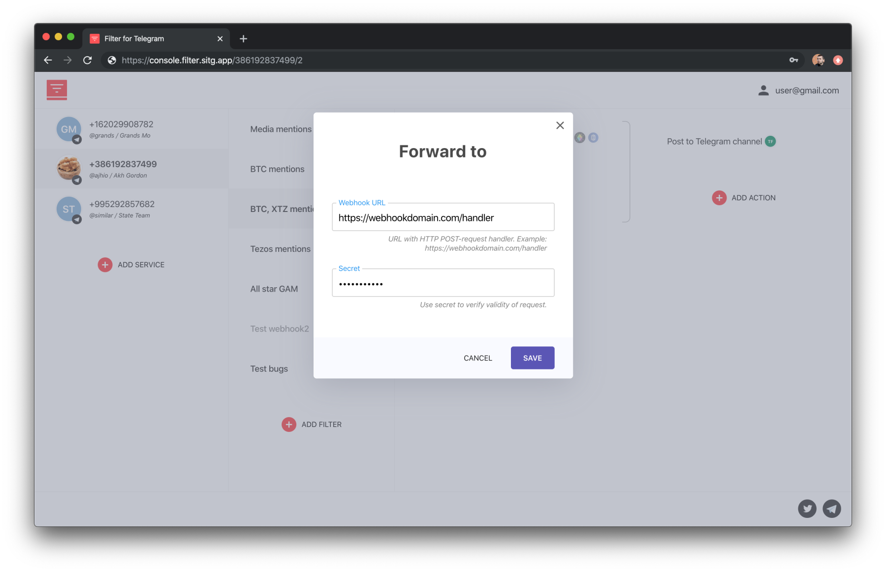

<p align="center">
  
</p>

##

Filter is cloud software for filtering and forwarding telegram messages. It's **Webhooks API** gives a way to access Telegram messages in JSON format.

### How to configure Webhook

In the [web console](https://console.filter.sitg.app) for your Telegram account, add a filter rule and then press `Add action` to choose `Webhook`.

Note that you can use a wildcard rule to forward all messages. To do that create a condition as this '_When **any user** in **any common chat** posts **anything**_'.
To forward your messages sent from your Telegram account `USER FILTER` -> `Include my messages`, so you will get '_When **any user (including me)** in **any common chat** posts **anything**_'

<p align="center">
  <picture>
    <source src-set="s/webhook.webp" type="image/webp" />
    <source src-set="s/webhook.png" type="image/png" />
    
  </picture>
</p>

### Webhook payload

Filter backend receives a message, downloads attachments and re-upload it to temporary storage (so consumers can download them for up to 24 hours) and then sends post request. Filter webhooks implementation is similar to [Github's one](https://developer.github.com/webhooks/).

#### Delivery headers

HTTP POST payloads that are delivered to your webhook's configured URL endpoint will contain a special header:
**`X-Filter-Signature`**. The HMAC hex digest of the response body. This header will be sent if the webhook is configured with a secret. The HMAC hex digest is generated using the sha1 hash function and the secret as the HMAC key.

Also, the `User-Agent` for the requests will have the prefix `Telegram Filter`.

#### Example delivery

```console
POST /handler HTTP/1.1
User-Agent: Telegram Filter
Accept: */*
X-Filter-Signature: sha1=ef2b441f473af57d428053fa5bce64cd9101c9c0
Content-Type: application/json
TE: gzip, deflate; q=0.5
Host: 127.0.0.1:3001
Connection: keep-alive
Content-Length: 1557
{
  _type: 'Filter$WebhookMessage',
  message: {
    _type: 'TdApi$Message',
    id: 648019968,
    ...
    content: {
      _type: 'TdApi$MessageText',
      text: { _type: 'TdApi$FormattedText', text: 'message text', entities: [] }
    }
  },
  chat: {
    _type: 'Filter$WebhookChat',
    id: -1001424174136,
    type: { _type: 'TdApi$ChatTypeSupergroup', supergroupId: 1424174136, isChannel: false },
    title: 'Test group'
  },
  chatMember: {
    _type: 'TdApi$ChatMember',
    userId: 18283932,
    ...
    status: { _type: 'TdApi$ChatMemberStatusCreator', customTitle: '', isMember: true }
  },
  user: {
    _type: 'Filter$WebhookUser',
    id: 18283932,
    firstName: 'Ask',
    lastName: 'Me',
    username: 'askmek',
    ...
    photoUrl:
      'https://filter-files-store.s3.amazonaws.com/telegram-avatars/34783478343id_293949404/18283932'
  }
}
```

#### Body format

In the POST-request you receive a JSON object of the following format:

```Typescript
interface WebhookMessage extends TelegramObject {
  _type: 'Filter$WebhookMessage'
  chat: WebhookChat | null
  chatMember: ChatMember | null
  fileUrl: string | null
  message: Message
  user: WebhookUser | null
}
```

Type definitions for `TypeScript` [./types/webhool-message.d.ts](./types/webhook-message.d.ts). Those type definitions are derived from auto-generated java bindings [`TdApi.java`](`./types/TdApi.java`).

If interface has `_type` starting with `TdApi$` it means it was generated from `TdApi.java` without modifications. If `_type` starts with `Filter$` - it's one of `WebhookMessage`, `WebhookChat` or `WebhookUser` that are enriched with URLs to the media linked to the message, chat or user.

A `fileUrl` field in `WebhookMessage` is URL to the message attachment which `Filter` uploads to it's own S3-storage.
A `photoUrl` field in `WebhookChat` and `WebhookUser` is URL to the picture (when it exists) of `chat` or `user`

`Filter` stores files for 24 hours during which clients should download them (if they need). A current size limit is `100 MB` per attachment. If attachment is bigger it would be skipped.

#### Example Webhook implementation

TODO
